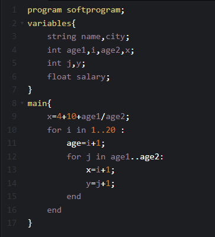

# Compilation Project

## This compilation project is for a SOFT language that everyone can learn. I wrote it in the C programming language and only contains the lexical and syntax analyzer.

I have decided to write a new simple compiler. It is known for being straightforward and less verbose, making it a good foundation for my new compiler. My goal is to provide an easy-to-understand and user-friendly compiler that will help beginner developers become familiar with programming quickly. This project conains three files:
* compiler.c contains the main function.
* fonctions.h provides global variables as well as prototypes of all the functions.
* fonctions.c contains the definition of functions.

## How to run this project in your local machine

First, you need to install C/C++ IDE like Code::Blocks, after upload this three files in this IDE with a file txt contains a test for example :

